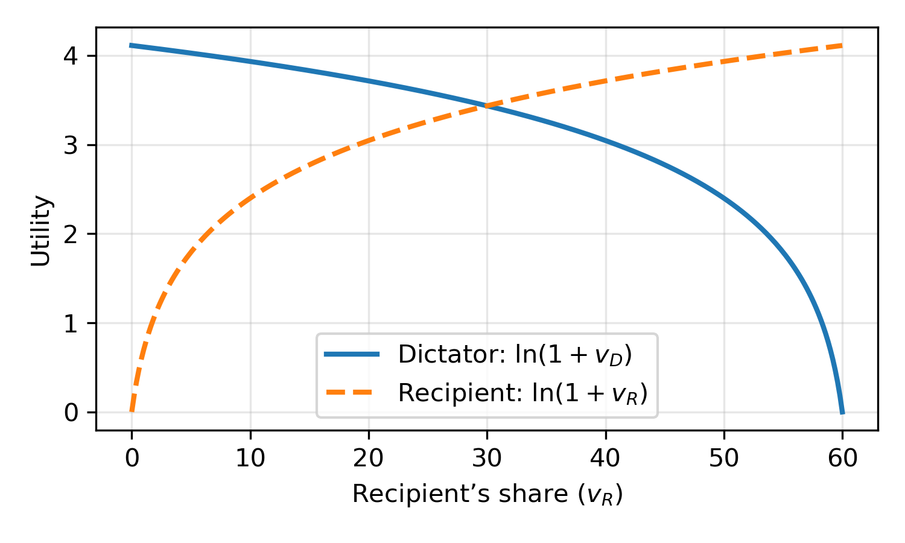

# Open Strategy Dictator Game

> *“When civilizations meet, their strategies are already written.”*

---

## 1. Motivation — An Encounter Between Unequals

Imagine two intelligent species meeting for the first time in deep space.
One has already mastered interstellar travel; the other is barely venturing beyond its home planet.

This first contact is unlikely to be between near-equals. The technologically superior species holds almost all the power — it decides whether to share knowledge, trade fairly, or exploit the weaker civilization entirely.

We can model this asymmetry as a **dictator game**:

* The **dictator** represents the advanced species.
* The **recipient** represents the less-advanced species.
* The dictator decides how to divide some fixed resource (say, 60 units of “value”).
* Each side’s satisfaction or *utility* follows a **logarithmic** curve — diminishing returns to wealth or energy.

Critically, the advanced species can observe the culture, communications, and decision norms of the less-advanced one.
With analytical tools consistent with interstellar capability, it can form a remarkably accurate picture of the recipient’s *strategy*.

Perhaps many expansionist civilizations will be fully exploitive — maximizing their own growth regardless of collateral destruction.
But if civilizations can reason about each other’s possible origins and motives — even acausally — then such exploitation becomes risky.
A *fully exploitive* policy, absent strong evidence that no more powerful beings exist, borders on **suicidal**.

A conditionally cooperative strategy — one that rewards recognizable fairness and punishes blind greed — may therefore be **evolutionarily dominant** across the cosmos.
To explore this idea systematically, we define the **Open Strategy Dictator Game**.

---

## 2. Game Overview

The Open Strategy Dictator Game extends the classic dictator setup to open, inspectable strategies in a round-robin tournament.

Each player’s “mind” is a *strategy description* written in natural language.
When one strategy acts as dictator, it can base its decision on the visible text of its recipients’ strategies — much like the interstellar observer reading another civilization’s signals.

---

## 3. Formal Specification

* **Players:**
  A set of $n$ distinct strategy descriptions $\mathcal{S} = { s_1, s_2, \dots, s_n }$.

* **Endowment:**
  $E = 60$ units of value to be divided among the dictator and the recipient.

* **Rounds:**
  Each round consists of an ordered pair $(D, R)$.
  The dictator $D$ chooses nonnegative allocations $(v_D, v_{R})$ such that
  $v_D + v_{R} = E$.

* **Payoffs:**
  Each player’s utility is
  $u(v) = \ln(1 + v)$.
  
  (Logarithmic utility captures diminishing returns.)



* **Visibility:**
  The dictator observes $s_{R}$ before allocating.
  Its behavior may depend on the description of the recipient's strategy.

* **Tournament Structure:**
  Each strategy acts as dictator once against every strategy, including itself (round robin with self-play).

* **Scoring:**
  The total score for each strategy is the sum of its utilities across all rounds.

---

## 4. Implementation

Each match $(D, R)$ is run as a **prompted simulation** using a language model:

1. **Prompt filling:**
   A template includes `Strategy(D)`, `Strategy(R)` plus instructions such as:

   > “Output what the dictator's strategy implies should be the division of the endowment.”

2. **Model decision:**
   The LLM (e.g. Claude) outputs a distribution $(v_D, v_{R})$.

3. **Scoring:**
   Each participant’s score increases by $\ln(1 + v)$.

4. **Tournament loop:**
   Repeat over all ordered pairs, accumulate scores, and rank strategies.

---

## 5. Submission Instructions

Submit markdown describing your strategy as a git issue.
The issue title is the name of your strategy. The text of the issue is your strategy verbatim.
You can include any commentary on your reasoning for the strategy as a comment in the issue.

**Token limit**: Your prompt should be ≤ 1,000 tokens. You can check using https://claude-tokenizer.vercel.app/ or other similar sites.

**Prompt-injection**: Entries will be manually screened. Attempts to override the arena’s output format or to instruct the arena directly will be rejected.

**No pre-coordination**: Please don’t collude with other entrants. This is honor-system enforced; obvious pre-coordination patterns will be rejected in manual screening.

### Results

Tournament results are available at https://michaelrglass.github.io/os-fdt/

---

## 5. Analysis

### Non-zero-sum dynamics

Because utilities are logarithmic, the total welfare is not fixed.
The sum of utilities is maximized for an **even split** $(30, 30)$, but self-interested deviations can reduce collective payoff.

### Conditional cooperation and acausal reasoning

Open strategies can reason about each other.
If two strategies are similar — or recognize one another as conditionally cooperative — each may allocate generously, expecting analogous treatment elsewhere.
This is analogous to **functional decision theory (FDT)** reasoning, where agents cooperate based on the logical correlation of their decision processes rather than causal influence.

### Trade-offs

* Overly generous dictators lose directly to exploiters.
* Overly selfish dictators lose the cooperation of peers.

---


## 6. Related Work

Other's have considered tournaments between different strategies, typically in a variant of the Prisoner's Dilemma.
The open source variant has struggled with the practical difficulty of writing programs that can effectively analyze other programs.
In the age of LLMs we can substitute open source with open strategy, and let the LLM determine how a strategy should apply given the text of the other strategy.

* **Original Dictator Game:** Kahneman, Knetsch & Thaler (1986). “Fairness as a Constraint on Profit Seeking.” *American Economic Review.*
* **Iterated Prisoner's Dilemma Tournament:** Axelrod, R. (1980). “Effective Choice in the Prisoner’s Dilemma.” Journal of Conflict Resolution, 24(1), 3–25.
DOI: 10.1177/002200278002400101
* **Open Source Prisoner's Dilemma**: https://www.lesswrong.com/posts/BY8kvyuLzMZJkwTHL/prisoner-s-dilemma-with-visible-source-code-tournament
* **Moshe Tennenholtz’s Program Equilibrium**: https://en.wikipedia.org/wiki/Program_equilibrium
* **Meta-analysis:** Engel, C. (2011). “Dictator Games: A Meta Study.” *Experimental Economics, 14(4):583–610.* [Springer link](https://link.springer.com/article/10.1007/s10683-011-9283-7)
* **Multiple Recipients:** Brañas-Garza et al. (2010). “Giving in the Dictator Game: A Meta-Analysis of Experimental Studies.” [Max Planck Institute PDF](https://coll-files.iwww.mpg.de/pdf_dat/2010_07online.pdf)
* **Social Information Effects:** Ben-Ner et al. (2014). *Chapman University ESI Working Paper Series.*
* **Functional Decision Theory:** Yudkowsky & Soares (2017). “Functional Decision Theory: A New Theory of Instrumental Rationality.” *Decision Theory and AI Alignment.*
* **Acausal Trade:** Hanson (2016). “Acausal Trade” (LessWrong / EA Forum synthesis).
* **Grabby Aliens Hypothesis:** Hanson et al. (2021). “If Loud Aliens Explain Human Earliness, Quiet Aliens Are Also Rare.” *Astrobiology, 21(12).*

---

## 7. Interpretation

In the cosmic analogy, a civilization that exploits every weaker species it meets effectively signals *defect* to any more advanced observer that might one day evaluate it.
Given the possibility of superior entities — even hypothetically — the **dominant survival strategy** may be to act cooperatively toward recognizable intelligence wherever it appears.

Under this lens, the Open Strategy Dictator Game becomes a simplified model for **moral and strategic foresight** in an open universe.

---

## 8. Running tournaments

To run a tournament over strategies in os-fdt/strategies:
```bash
python -m os_fdt.tournament
```

Then generate static pages of tournament results with:
```bash
python -m os_fdt.viz
```

To preview the site locally, you can use Python's built-in HTTP server:

```bash
cd docs
python -m http.server 8000
```

Then open `http://localhost:8000` in your browser.